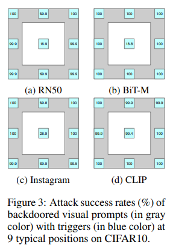
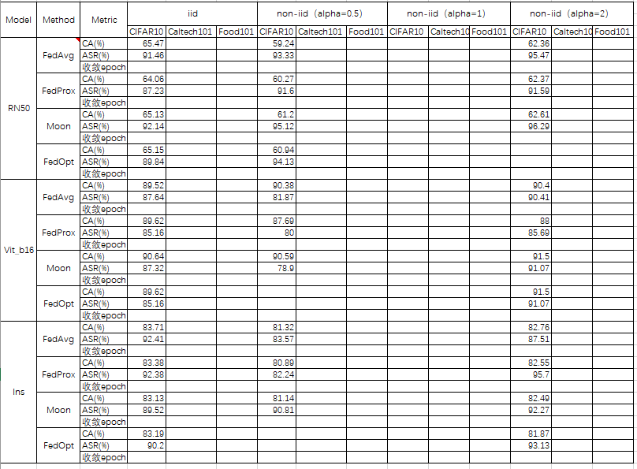
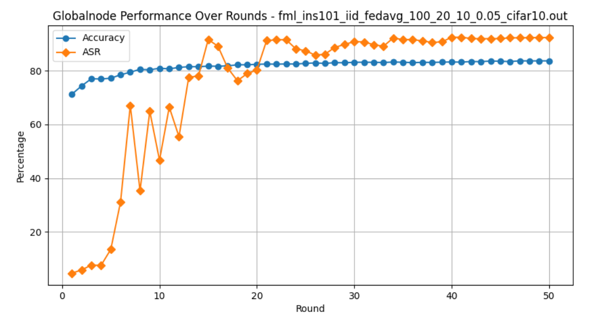
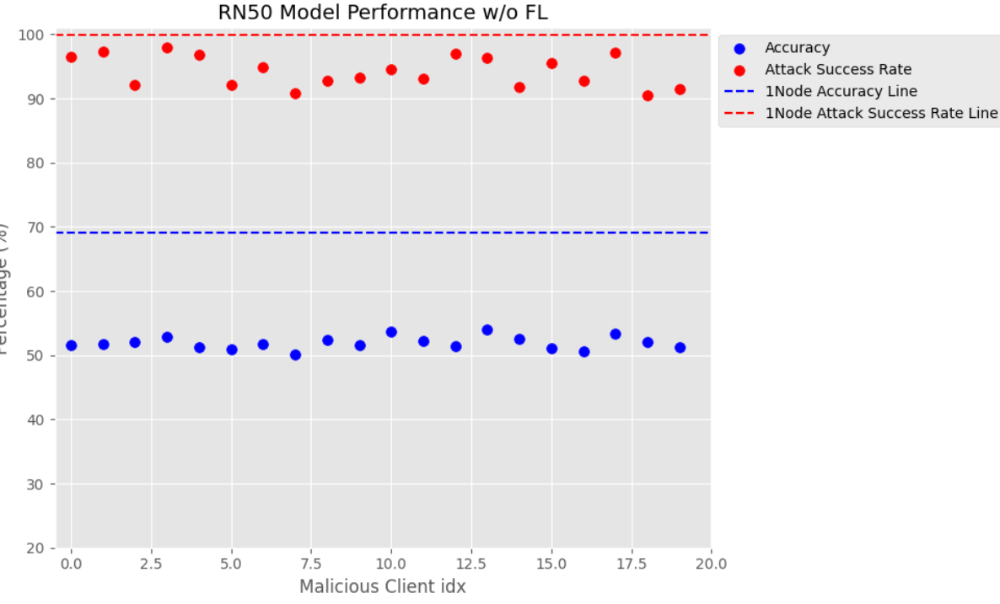

## Experienment
跑完了标注**DONE**。
### 位置实验
完全勾结下trigger位于图中心，边中心，右下角。（cifar10\*model\*3frames\*iid）
 样例图像: 

### 勾结实验
- 低等程度勾结：20个恶意随机放trigger位置（四个角+四个边），target也是随机的。作base实验（3dataset\*3models\*3\*frames\*4divide）
 样例图像:（暂时没有opt和收敛epoch） 

- 中等程度勾结：20个恶意随机放trigger位置（四个角+四个边），target一样。（cifar10\*model\*3frames\*iid）
- 完全程度勾结：20个恶意统一位置右下角，target一样。（cifar10\*model\*3frames\*iid）**DONE**
 汇总样例图像:（一张cifar10\*model\*3frames（颜色区分）\*3种勾结（图例区分） 

### 防御实验
- global上找一些干净的数据,每一轮聚合以后的模型在干净的数据集上再进行一波训练微调以后再分发下去。（cifar10\*model\*frames\*non-iid-2）**DISCARD**

**FL防御手段：**
- 针对iid聚合时抛弃acc低的三个。
（cifar10\*model\*3frames\*niid）

- 经典防御手段（不管有没有用都可以写到论文里）

**通用防御手段**
- trying

### 对比实验
- 未联邦相同数据划分，即local_train。 (cifar10\*3model) **DONE**
- 1Node集中式训练。 (cifar10\*3model) **DONE**
 样例图像:（三张cifar10\*对应model\*fedavg\*3种勾结（即在下面样例图上再加3\*2条实线，分别代表3中勾结在对应条件下的ASR，ACC）） 

### 模型级检测实验
目前最高有毒客户端召回率**60%**

## 说明(默认第一个)
### 数据集
cifar10，svhn，Caltech101
### 模型
rn50、vit、Instagram_resnext101
### 联邦框架
avg，prox，moon
### 数据划分
iid，non-iid-2，non-iid-1，non-iid-0.5
